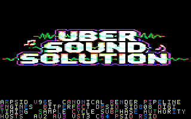

# ArpSID v965 C64 Teaser — Release Candidate 1

Copyright © 2026 Ulf Bertilsson. Licensed under the
[GNU General Public License v3.0 or later](LICENSE).

C64 teaser using the original **UBER SOUND SOLUTION** multicolor bitmap, the audited three-voice Megablast music engine, and four independent ArpSID feature scrollers derived from `docs/AI2AI_ARPSID_V965_LOWLEVEL_HANDOFF.md`.

RC1 freezes the fully audited implementation for emulator and real-hardware acceptance testing. All live VIC-II objects share ROM-free bank 1, sprite state is completed before the first sprite DMA line, all same-frame visual consumers observe one immutable beat-envelope value, the VSync scroller runs at raster 0, and the frame-tail IRQ remains lightweight.

## Active release contracts

- `ARPSID_V965_TEASER_RELEASE_ACTIVE`
- `SINGLE_VIC_BANK1_DISPLAY_ACTIVE`
- `RASTER_BANK_SWITCH_REMOVED_ACTIVE`
- `VBLANK_TOP_SCROLLER_AUTHORITY_ACTIVE`
- `UNIFIED_BEAT_FRAME_AUTHORITY_ACTIVE`
- `SPRITE_PREVISIBLE_UPDATE_ORDER_ACTIVE`
- `CIA2_SINGLE_WRITE_AUTHORITY_ACTIVE`
- `BUILDER_ASSERTION_ENFORCEMENT_ACTIVE`
- `SID_CUTOFF_LOW_BITS_CLEAN_ACTIVE`
- `INDEPENDENT_ROW_OFFSET_SPEED_SCROLLER_ACTIVE`
- `GLYPH_EDGE_CLEAN_SCROLL_ACTIVE`
- `FULL_MESSAGE_LOOP_AND_COLOR_PHASE_FIX_ACTIVE`
- `MEGABLAST_DEEP_AUDIT_FIX_ACTIVE`
- `ORIGINAL_UBER_BACKGROUND_RESTORED_ACTIVE`

## VIC-II memory map

```text
$1000-$1b5f  code, music engine, IRQs and tables
$4400-$47e7  bitmap screen matrix
$47f8-$47ff  sprite pointers
$4c00-$4fe7  dedicated text screen
$5000-$57ff  custom 2 KB charset
$6000-$7f3f  8000-byte multicolor bitmap
$7f80-$7fff  two sprite shapes
$8000-$b5a7  immutable source assets, sprite source and feature messages
```

All live display objects use VIC bank 1 (`$4000-$7fff`). CIA2 `$dd00` is written exactly once at startup while preserving its upper six bits. No raster handler rewrites CIA2 or can disturb user-port/serial output bits.

Bitmap mode uses `$d018=$18`: screen `$4400`, bitmap `$6000`. Text mode uses `$d018=$34`: screen `$4c00`, charset `$5000`.

## Raster and scroller

- `IrqTop` at raster `$00`: music, bitmap color reaction, pre-visible sprite update, VU update, one beat decay and the VSync scroller.
- `IrqSplit` at `$d2`: final bitmap scanline handoff.
- Row phase IRQs at `$e2`, `$ea`, and `$f2`.
- `IrqBottom` at `$fb`: lightweight vector reset only; no subroutine calls or bulk RAM movement.
- The split performs zero CIA2 writes and completes its mode/pointer handoff in the right border.
- `$d016` completes at modeled PAL cycle 55, `$d018` at 61, and `$d011` at absolute cycle 67 before the bounded two-cycle entry jitter.
- Text uses 38-column mode so hidden edge columns absorb fine-scroll fetch artifacts.

Independent lanes use starting offsets **7/5/3/1**:

```text
row 21  initial fine offset 7  speed 0.75 pixel/frame
row 22  initial fine offset 5  speed 1.00 pixel/frame
row 23  initial fine offset 3  speed 1.25 pixels/frame
row 24  initial fine offset 1  speed 1.50 pixels/frame
```

Each lane owns its own Q2 fractional accumulator, fine-X phase, message pointer and continuous rainbow phase. Every 360-character stream loops from its true beginning.

## Unified beat and sprite timing

`MusicTick` establishes `BeatEnv`. `BeatRasterTick`, `StarTick`, and `VuBarsTick` all consume that same value. `BeatEnvDecay` advances it exactly once after all visual consumers.

The top order is:

```text
MusicTick -> BeatRasterTick -> StarTick -> VuBarsTick -> BeatEnvDecay -> Scroller_Tick
```

The maximum pre-sprite path is **3044 modeled cycles**, completing before the first sprite DMA line. The full raster-0 workload is **6545 modeled cycles**; adding the verifier’s conservative **1500-cycle VIC steal allowance** still totals only 8045 cycles before the `$d2` split.

## Music

- Three voices: chord/arp, bass, and lead.
- Voice loops: 192 / 384 / 384 frames.
- Four-section macro arrangement: 1536 frames.
- Correct gate-off waveform handling.
- Bounded pulse width and filter cutoff.
- SID cutoff-low writes are explicitly masked to bits 0–2.
- Static `$d418=$1f`; no volume-register pumping during playback.
- Bass events drive the visual beat envelope.

## Startup and interrupt robustness

- `SEI` then `CLD` guarantees binary arithmetic.
- RAM NMI vector is installed immediately after CPU-port banking, before the long asset copy.
- `NmiStub` preserves A and acknowledges CIA2 ICR.
- All pending VIC-II IRQ flags are cleared before enabling raster IRQ only.
- The deterministic fallback assembler now executes the source `!if/!error` memory assertions instead of silently skipping them.

## Validation

The release verifies:

- exact original bitmap/screen/color/font hashes;
- deterministic PRG and label-map rebuilds;
- 1536-frame executable 6502 music/visual/scroller simulation;
- 4096-frame independent scroller simulation;
- full message wrap and continuous rainbow phase;
- glyph right-edge and bottom-scanline cleanliness;
- sprite-pointer isolation at `$47f8-$47ff`;
- exact runtime copies to `$4400/$5000/$6000`;
- no `$d418` writes during playback;
- single CIA2 bank-write authority;
- early NMI vector installation;
- fallback-builder compile-time assertion enforcement;
- complete SHA-256 manifest coverage.

Measured model results:

```text
runtime asset install          195254 cycles
maximum MusicTick                1808 cycles
maximum pre-sprite path           3044 cycles
maximum visual top core           4830 cycles
maximum full raster-0 work        6545 cycles
conservative VIC steal allowance   1500 cycles
maximum Scroller_Tick             2480 cycles
asset source usage          13736 / 16384 bytes
asset source headroom             2648 bytes
PRG load/end                $0801 / $b5a8
PRG size                          44457 bytes
```

## Build

```bash
make clean
make verify
```

When ACME is installed, the Makefile assembles with ACME and the deterministic Python assembler and requires byte-identical PRGs. Without ACME, the fallback builder remains deterministic and now enforces the same packaged memory assertions.

## RC1 acceptance boundary

This package is the first release candidate. Source, data, binary layout and included verification contracts are frozen for acceptance testing. Promotion from RC1 requires an emulator smoke test and preferably PAL/NTSC real-hardware confirmation; any binary-changing repair must become a later release candidate.

## External boundary

ACME, VICE and physical C64/SID capture were not available in the audit environment. The deterministic assembler, source/branch/overlap guards and executable NMOS-6502 model passed. Real-hardware smoke testing remains the strongest external proof for analog SID output and exact VIC-II silicon behavior.

## Runtime preview


